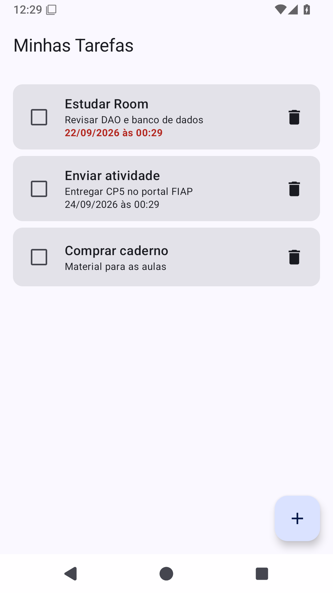
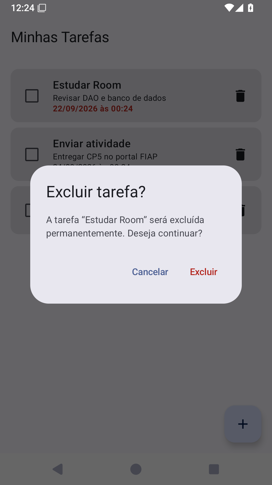
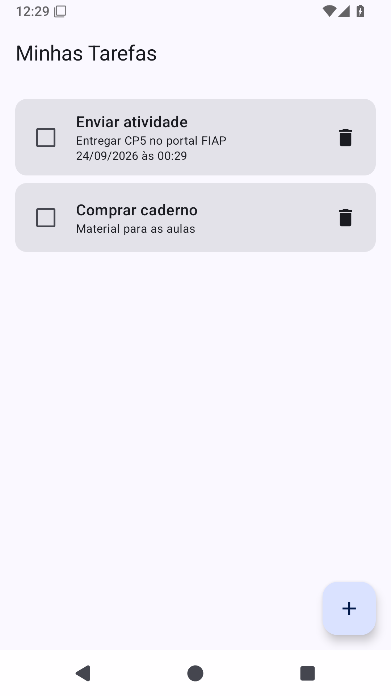

# Evidências — confirmação de exclusão

**PENDENTE: capturas reais do emulador.** Este arquivo é um roteiro; não representa testes executados. Os links abaixo serão exibidos quando as imagens forem adicionadas.

Cadastre “Estudar Room” e “Enviar atividade”. Use a lixeira da primeira tarefa nos passos abaixo.

## 1. Lista antes da exclusão
Capture as duas tarefas na lista.

## 2. Diálogo aberto
Toque na lixeira de “Estudar Room”. Verifique o título da tarefa e os botões Cancelar e Excluir.

## 3. Resultado ao cancelar
Toque em Cancelar. As duas tarefas devem continuar na lista.

## 4. Nova abertura
Toque novamente na lixeira de “Estudar Room”.

## 5. Resultado após confirmar
Toque em Excluir. Apenas “Enviar atividade” deve permanecer.

Após capturar e conferir os cinco resultados, substitua o aviso de pendência por uma descrição da execução e faça commit das imagens e deste arquivo.
